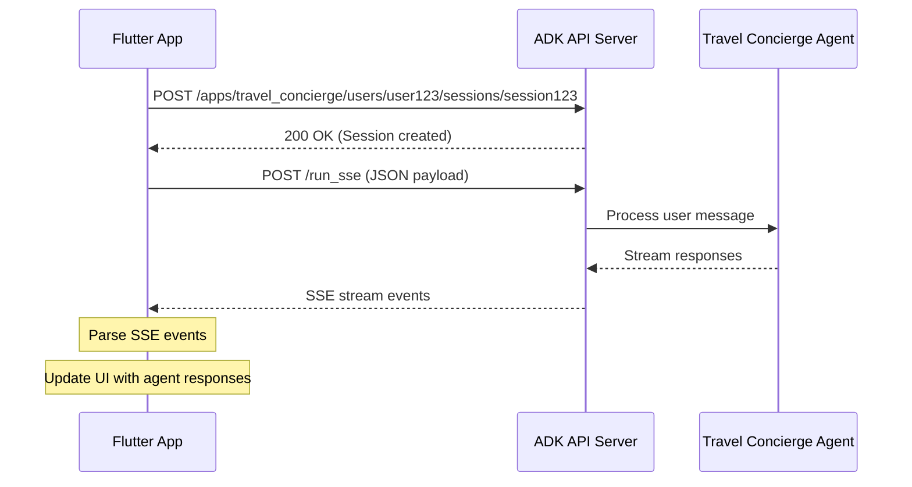

# 🎯 TỔNG KẾT: Flutter Client cho Travel Concierge API

## 📋 CÂU TRA LỜI CHO CÂU HỎI CỦA BẠN

### 1. **Có cần tạo API mới không?**
❌ **KHÔNG CẦN!** ADK đã cung cấp sẵn RESTful API server.

### 2. **ADK Web Server có cung cấp APIs không?**
✅ **CÓ!** ADK cung cấp FastAPI server với đầy đủ endpoints:
- **Session management**: Tạo và quản lý sessions
- **Message streaming**: Real-time SSE responses
- **API documentation**: Tự động tạo docs tại `/docs`

### 3. **Có thể dùng API có sẵn cho mobile app không?**
✅ **HOÀN TOÀN CÓ THỂ!** API structure rất phù hợp cho mobile:
- JSON payload đơn giản
- RESTful endpoints
- Real-time streaming
- Error handling built-in

## 🚀 SOLUTION ĐÃ CUNG CẤP

### 📁 **Files đã tạo:**

1. **`flutter_client_sample.dart`** - Flutter app hoàn chỉnh
2. **`pubspec.yaml`** - Dependencies configuration
3. **`api_config.dart`** - API configuration và data models
4. **`test_api_client.py`** - Python test client
5. **`README_FLUTTER.md`** - Hướng dẫn chi tiết
6. **`FLUTTER_API_SUMMARY.md`** - Tổng kết (file này)

### 🔧 **Technical Stack:**

**Flutter Client:**
- **HTTP client**: Sử dụng `http` package
- **SSE handling**: Stream processing cho real-time response
- **State management**: StatefulWidget với proper state handling
- **UI/UX**: Modern chat interface với message bubbles

**API Integration:**
- **Session creation**: `POST /apps/travel_concierge/users/{userId}/sessions/{sessionId}`
- **Message sending**: `POST /run_sse` với SSE streaming
- **Payload structure**: JSON với proper schema validation

## 📊 **API WORKFLOW**



## 🎨 **Flutter App Features**

### **Core Features:**
- ✅ Session management tự động
- ✅ Real-time chat interface
- ✅ SSE streaming với proper parsing
- ✅ Loading states và error handling
- ✅ Auto-scroll và timestamp
- ✅ Function response indicators

### **UI Components:**
- **Chat bubbles**: User (blue) vs Agent (gray)
- **Typing indicator**: Khi agent đang xử lý
- **Function indicators**: Icons cho các function calls
- **Error messages**: System notifications
- **Input area**: Text field với send button

### **Advanced Features:**
- **Multi-agent support**: Hiển thị tên agent
- **Function call tracking**: Debug info cho function calls
- **Rich response handling**: Special handling cho các loại response khác nhau
- **Session persistence**: Maintain state across interactions

## 💡 **Ví dụ sử dụng thực tế:**

### **Sample Conversations:**

1. **Destination Inspiration:**
   ```
   User: "Inspire me about destinations in Southeast Asia"
   → Agent calls place_agent
   → Returns carousel of destinations với images và highlights
   ```

2. **Activity Planning:**
   ```
   User: "Show me activities in Bali for 3 days"
   → Agent calls poi_agent
   → Returns activities list với descriptions
   ```

3. **Complete Trip Planning:**
   ```
   User: "Plan a 5-day trip to Thailand from Vietnam"
   → Agent calls multiple functions: flights, hotels, itinerary
   → Returns complete travel plan
   ```

## 🔧 **Setup Instructions:**

### **1. Start ADK Server:**
```bash
cd D:\DucTN\Source\travel-concierge
python -m adk api_server travel_concierge
# Server runs at http://127.0.0.1:8000
```

### **2. Test API (Python):**
```bash
python test_api_client.py
```

### **3. Run Flutter App:**
```bash
flutter create travel_concierge_client
# Copy files và run
flutter pub get
flutter run
```

## 📱 **Mobile Integration Benefits:**

### **Why this approach is perfect:**

1. **No custom API needed**: Reuse ADK's robust API infrastructure
2. **Real-time experience**: SSE streaming cho instant responses
3. **Function-rich**: Support cho complex travel planning workflows
4. **Scalable**: Session management cho multiple users
5. **Well-documented**: Auto-generated API docs
6. **Production-ready**: Built on FastAPI với proper error handling

### **Rich UI Possibilities:**

- **Destination cards**: với images từ place_agent responses
- **Flight/hotel lists**: với booking actions
- **Interactive maps**: cho POI suggestions
- **Itinerary timeline**: cho trip planning
- **Chat actions**: Quick reply buttons

## 🎯 **Kết luận:**

**BẠN KHÔNG CẦN TẠO API MỚI!**

Solution hoàn chỉnh đã có:
- ✅ ADK cung cấp production-ready APIs
- ✅ Flutter client hoàn chỉnh với modern UI
- ✅ Real-time streaming cho instant responses
- ✅ Extensible architecture cho future features
- ✅ Comprehensive documentation và examples

**Next steps:** Copy files, start server, và enjoy your Travel Concierge mobile app! 🚀

---

*Tất cả code đã sẵn sàng để sử dụng. Chỉ cần follow setup instructions là có thể chat với Travel Concierge Agent qua mobile app!* 📱✈️